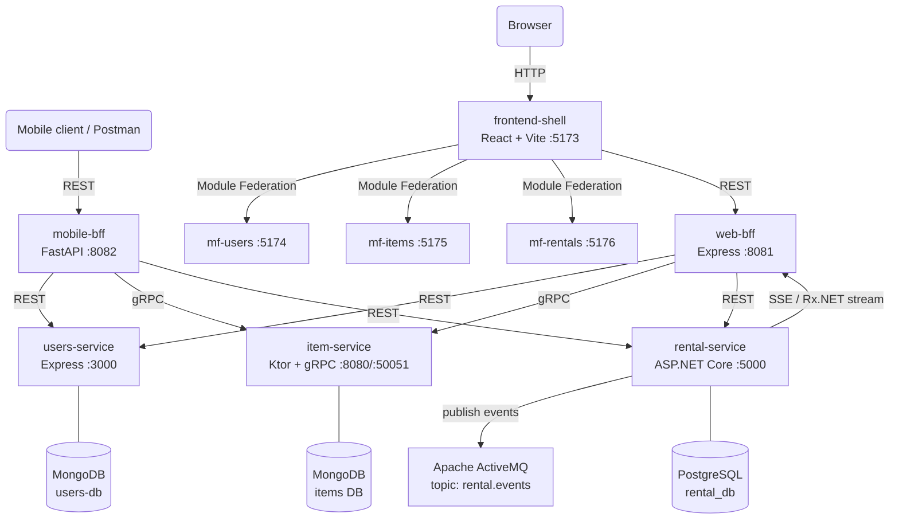

# ToolLoop

ToolLoop je mikrostoritvena platforma za izposojo predmetov med uporabniki. Sistem omogoča objavo predmetov, pregled razpoložljivih predmetov in ustvarjanje zahtevkov za izposojo za izbrano časovno obdobje.

Projekt prikazuje heterogeno mikrostoritveno arhitekturo z več tehnologijami, ločenimi podatkovnimi bazami, BFF slojem, micro-frontend pristopom, gRPC komunikacijo, reaktivnim tokom dogodkov in sporočilnim posrednikom Apache ActiveMQ.

---

## Arhitektura



---

## Storitve

| Storitev | Namen | Tehnologije | Protokol | Vrata |
|---|---|---|---|---|
| `users-service` | registracija, prijava, profili uporabnikov | Node.js, Express, MongoDB, Mongoose, JWT | REST | `3000` |
| `item-service` | katalog predmetov, kategorije, statusi, razpoložljivost | Kotlin, Ktor, gRPC, MongoDB | REST + gRPC | `8080`, `50051` |
| `rental-service` | ustvarjanje in upravljanje izposoj | ASP.NET Core, EF Core, PostgreSQL, Rx.NET, ActiveMQ | REST + SSE | `5000` |
| `web-bff` | API gateway za spletni frontend | Node.js, Express, Axios, gRPC client | REST | `8081` |
| `mobile-bff` | API gateway za mobilni/Postman odjemalec | Python, FastAPI, httpx, grpc.aio | REST | `8082` |
| `frontend-shell` | glavna React aplikacija | React, Vite, Module Federation | HTTP UI | `5173` |
| `mf-users` | micro-frontend za uporabnike | React, Vite | federiran modul | `5174` |
| `mf-items` | micro-frontend za predmete | React, Vite | federiran modul | `5175` |
| `mf-rentals` | micro-frontend za izposoje | React, Vite | federiran modul | `5176` |

---

## Domene sistema

### Uporabniki

`users-service` upravlja uporabnike, avtentikacijo in avtorizacijo. Omogoča registracijo, prijavo, branje uporabnikov, posodobitev profila in brisanje uporabnika. Za zaščitene operacije uporablja JWT Bearer žeton.

### Predmeti

`item-service` upravlja katalog predmetov. Predmet vsebuje lastnika, naziv, opis, kategorijo, status, lokacijo in časovne žige. Status predmeta je lahko `AVAILABLE`, `BORROWED` ali `UNAVAILABLE`.

Storitev izpostavlja REST API za HTTP klice in gRPC API za interno komunikacijo z BFF slojem.

### Izposoje

`rental-service` upravlja življenjski cikel izposoj. Izposoja vključuje predmet, izposojevalca, lastnika, začetni in končni datum, status ter dodatno sporočilo.

| Status | Opis |
|---|---|
| `Pending` | zahteva čaka na odločitev |
| `Approved` | lastnik je zahtevo odobril |
| `Rejected` | lastnik je zahtevo zavrnil |
| `Active` | izposoja je aktivna |
| `Completed` | izposoja je zaključena |
| `Cancelled` | izposoja je preklicana |

Ob spremembah `rental-service` objavlja dogodke v ActiveMQ topic `rental.events` in izpostavlja SSE tok za žive posodobitve.

---

## BFF sloj

Projekt uporablja Backend-for-Frontend vzorec. Frontend ne komunicira neposredno z vsemi mikrostoritvami, ampak uporablja namenski gateway.

### `web-bff`

`web-bff` je namenjen spletnemu React frontendu. Združuje REST in gRPC komunikacijo ter izpostavlja enoten REST API pod `/api/web`.

Odgovornosti:

- avtentikacija in uporabniki,
- dostop do predmetov prek gRPC,
- dostop do izposoj prek REST,
- agregacija dashboard podatkov,
- proxy za SSE stream iz `rental-service`.

### `mobile-bff`

`mobile-bff` je namenjen mobilnim odjemalcem oziroma Postman testiranju. Izpostavlja REST API pod `/api/mobile` in vrača prilagojene odzive za mobilni primer uporabe.

Odgovornosti:

- mobilna prijava in registracija,
- mobilni profil uporabnika,
- katalog razpoložljivih predmetov,
- ustvarjanje zahtevkov za izposojo,
- mobilni feed z agregiranimi podatki.

---

## Frontend

Frontend je zasnovan kot micro-frontend aplikacija. Glavna aplikacija `frontend-shell` nalaga tri ločene domenske module:

| Modul | Namen |
|---|---|
| `mf-users` | registracija, prijava, profil in uporabniki |
| `mf-items` | katalog predmetov, ustvarjanje, urejanje in izposoja |
| `mf-rentals` | pregled izposoj, statusi in live dogodki |

`frontend-shell` skrbi za skupni layout, navigacijo, avtentikacijo, dashboard in nalaganje federiranih modulov prek Module Federation.

---

## Komunikacija

| Klicatelj | Cilj | Protokol | Namen |
|---|---|---|---|
| `frontend-shell` | `web-bff` | REST | enotna vstopna točka za spletni UI |
| `mobile client / Postman` | `mobile-bff` | REST | enotna vstopna točka za mobilni odjemalec |
| `web-bff` | `users-service` | REST | uporabniki in avtentikacija |
| `web-bff` | `item-service` | gRPC | katalog predmetov |
| `web-bff` | `rental-service` | REST | izposoje |
| `web-bff` | `rental-service` | SSE proxy | žive posodobitve izposoj |
| `mobile-bff` | `users-service` | REST | mobilni uporabniški podatki |
| `mobile-bff` | `item-service` | gRPC | mobilni katalog predmetov |
| `mobile-bff` | `rental-service` | REST | mobilne izposoje |
| `rental-service` | `ActiveMQ` | Topic event | objava domenskih dogodkov |

---

## API endpointi

### `users-service`

| Metoda | Endpoint | Opis | Auth |
|---|---|---|---|
| `POST` | `/api/users/register` | registracija uporabnika | ne |
| `POST` | `/api/users/login` | prijava uporabnika | ne |
| `GET` | `/api/users` | seznam uporabnikov | da |
| `GET` | `/api/users/:id` | posamezen uporabnik | da |
| `PUT` | `/api/users/:id` | posodobitev profila | da |
| `DELETE` | `/api/users/:id` | brisanje profila | da |
| `GET` | `/api-docs` | Swagger dokumentacija | ne |

### `item-service` REST

| Metoda | Endpoint | Opis |
|---|---|---|
| `GET` | `/items` | seznam vseh predmetov |
| `GET` | `/items?category=<category>` | filtriranje po kategoriji |
| `GET` | `/items?available=true` | seznam razpoložljivih predmetov |
| `POST` | `/items` | ustvarjanje predmeta |
| `GET` | `/items/owner/:ownerId` | predmeti določenega lastnika |
| `GET` | `/items/:id` | posamezen predmet |
| `PUT` | `/items/:id` | posodobitev predmeta |
| `PATCH` | `/items/:id/status` | sprememba statusa predmeta |
| `DELETE` | `/items/:id` | brisanje predmeta |

### `item-service` gRPC

| Metoda | Namen |
|---|---|
| `CreateItem` | ustvarjanje predmeta |
| `GetAllItems` | seznam vseh predmetov |
| `GetItem` | posamezen predmet |
| `GetItemsByOwner` | predmeti po lastniku |
| `GetAvailableItems` | razpoložljivi predmeti |
| `GetItemsByCategory` | predmeti po kategoriji |
| `UpdateItem` | posodobitev predmeta |
| `UpdateItemStatus` | sprememba statusa |
| `DeleteItem` | brisanje predmeta |
| `CheckItemAvailability` | preverjanje razpoložljivosti |

### `rental-service`

| Metoda | Endpoint | Opis |
|---|---|---|
| `POST` | `/api/rentals` | ustvarjanje izposoje |
| `GET` | `/api/rentals` | seznam vseh izposoj |
| `GET` | `/api/rentals?status=<status>` | filtriranje po statusu |
| `GET` | `/api/rentals/:id` | posamezna izposoja |
| `GET` | `/api/rentals/borrower/:borrowerId` | izposoje po izposojevalcu |
| `GET` | `/api/rentals/owner/:ownerId` | izposoje po lastniku |
| `GET` | `/api/rentals/item/:itemId` | izposoje po predmetu |
| `PATCH` | `/api/rentals/:id/status` | sprememba statusa |
| `DELETE` | `/api/rentals/:id?requesterId=<userId>` | preklic izposoje |
| `GET` | `/api/rentals/stream` | SSE tok sprememb |

### `web-bff`

| Metoda | Endpoint | Opis |
|---|---|---|
| `GET` | `/health` | preverjanje delovanja BFF |
| `POST` | `/api/web/auth/register` | registracija |
| `POST` | `/api/web/auth/login` | prijava |
| `GET` | `/api/web/users` | seznam uporabnikov |
| `GET` | `/api/web/users/:id` | uporabnik po ID |
| `PUT` | `/api/web/users/:id` | posodobitev uporabnika |
| `DELETE` | `/api/web/users/:id` | brisanje uporabnika |
| `GET` | `/api/web/items` | seznam predmetov |
| `GET` | `/api/web/items/available` | razpoložljivi predmeti |
| `GET` | `/api/web/items/category/:category` | predmeti po kategoriji |
| `GET` | `/api/web/items/owner/:ownerId` | predmeti po lastniku |
| `GET` | `/api/web/items/:id` | predmet po ID |
| `POST` | `/api/web/items` | ustvarjanje predmeta |
| `PUT` | `/api/web/items/:id` | posodobitev predmeta |
| `PATCH` | `/api/web/items/:id/status` | sprememba statusa predmeta |
| `DELETE` | `/api/web/items/:id` | brisanje predmeta |
| `POST` | `/api/web/items/:id/rentals` | ustvarjanje izposoje za predmet |
| `GET` | `/api/web/rentals` | seznam izposoj |
| `GET` | `/api/web/rentals/:id` | izposoja po ID |
| `POST` | `/api/web/rentals` | ustvarjanje izposoje |
| `PATCH` | `/api/web/rentals/:id/status` | sprememba statusa izposoje |
| `DELETE` | `/api/web/rentals/:id?requesterId=<userId>` | preklic izposoje |
| `GET` | `/api/web/rentals/stream` | SSE proxy |
| `GET` | `/api/web/dashboard/:userId` | agregiran dashboard |

### `mobile-bff`

| Metoda | Endpoint | Opis |
|---|---|---|
| `GET` | `/health` | preverjanje delovanja BFF |
| `POST` | `/api/mobile/auth/register` | registracija |
| `POST` | `/api/mobile/auth/login` | prijava |
| `GET` | `/api/mobile/users/:user_id/profile` | mobilni profil |
| `GET` | `/api/mobile/items/available` | razpoložljivi predmeti |
| `GET` | `/api/mobile/items/category/:category` | predmeti po kategoriji |
| `GET` | `/api/mobile/items/:item_id` | predmet po ID |
| `POST` | `/api/mobile/items/:item_id/rentals` | izposoja predmeta |
| `GET` | `/api/mobile/rentals/my/:user_id` | izposoje uporabnika |
| `PATCH` | `/api/mobile/rentals/:rental_id/status` | sprememba statusa |
| `DELETE` | `/api/mobile/rentals/:rental_id?requesterId=<userId>` | preklic izposoje |
| `GET` | `/api/mobile/feed/:user_id` | mobilni agregiran feed |

---

## Tehnologije

| Področje | Tehnologije |
|---|---|
| Backend | Node.js, Express, Kotlin, Ktor, ASP.NET Core, Python, FastAPI |
| Komunikacija | REST, gRPC, Server-Sent Events |
| Podatkovne baze | MongoDB, PostgreSQL |
| Messaging | Apache ActiveMQ |
| Reaktivnost | Rx.NET |
| Frontend | React, Vite, Module Federation |
| Avtentikacija | JWT |
| ORM/ODM | Mongoose, Entity Framework Core |
| Dokumentacija | Swagger / OpenAPI, Scalar |
| Kontejnerizacija | Docker, Docker Compose |
| Orkestracija | OpenShift |

---

## Projektna struktura

```text
Project/
  bff/
    web-bff/
      app.js
      server.js
      env.js
      userClient.js
      rentalClient.js
      itemGrpcClient.js
      authRoutes.js
      userRoutes.js
      itemRoutes.js
      rentalRoutes.js
      dashboardRoutes.js
      streamRoutes.js
      item.proto

    mobile-bff/
      main.py
      config.py
      user_client.py
      rental_client.py
      item_client.py
      auth_routes.py
      user_routes.py
      item_routes.py
      rental_routes.py
      feed_routes.py
      mobile_schemas.py
      item.proto

  frontend/
    frontend-shell/
      main.jsx
      vite.config.js

    mf-users/
      UsersApp.jsx
      vite.config.js

    mf-items/
      ItemsApp.jsx
      vite.config.js

    mf-rentals/
      RentalsApp.jsx
      vite.config.js

  services/
    users-service/
      app.js
      server.js
      User.js
      userController.js
      userRepository.js
      userRoutes.js
      authMiddleware.js
      db.js
      Dockerfile
      docker-compose.yml

    item-service/
      Application.kt
      Database.kt
      Item.kt
      ItemRepository.kt
      ItemService.kt
      Routes.kt
      ItemGrpcService.kt
      item.proto
      Dockerfile
      docker-compose.yml

    rental-service/
      Program.cs
      Rental.cs
      RentalDtos.cs
      RentalDbContext.cs
      RentalRepository.cs
      RentalService.cs
      RentalsController.cs
      RentalsStreamController.cs
      RentalStreamService.cs
      RentalStreamLogger.cs
      ActiveMqPublisher.cs
      ExceptionHandlingMiddleware.cs
      appsettings.json
      Dockerfile
      docker-compose.yml
```

---

## Zagon lokalno

### `users-service`

```bash
cd services/users-service
docker-compose up --build
```

URL:

```text
http://localhost:3000
```

### `item-service`

```bash
cd services/item-service
docker-compose up --build
```

URL-ja:

```text
REST: http://localhost:8080
gRPC: localhost:50051
```

### `rental-service`

```bash
cd services/rental-service
docker-compose up --build
```

URL:

```text
http://localhost:5000
```

SSE stream:

```text
http://localhost:5000/api/rentals/stream
```

### `web-bff`

```bash
cd bff/web-bff
npm install
npm start
```

URL:

```text
http://localhost:8081
```

### `mobile-bff`

```bash
cd bff/mobile-bff
uvicorn main:app --host 0.0.0.0 --port 8082
```

URL:

```text
http://localhost:8082
```

### Frontend

Vsak frontend modul se zažene ločeno:

```bash
cd frontend/frontend-shell
npm install
npm run dev
```

```bash
cd frontend/mf-users
npm install
npm run dev
```

```bash
cd frontend/mf-items
npm install
npm run dev
```

```bash
cd frontend/mf-rentals
npm install
npm run dev
```

| Modul | URL |
|---|---|
| `frontend-shell` | `http://localhost:5173` |
| `mf-users` | `http://localhost:5174` |
| `mf-items` | `http://localhost:5175` |
| `mf-rentals` | `http://localhost:5176` |

---

## Zagon na OpenShift

Minimalna orkestrirana postavitev vključuje:

- `item-service`,
- `rental-service`,
- `item-mongo`,
- `rental-postgres`,
- `activemq`.

Preverjanje stanja:

```bash
oc get pods
oc get svc
oc get endpoints item-service rental-service
oc get routes
```

Primer route URL-jev:

```text
https://item-service-<namespace>.apps.<cluster-domain>/items
https://rental-service-<namespace>.apps.<cluster-domain>/api/rentals
```

---

## Primeri testiranja v Postmanu

### `item-service`

```http
GET /items
```

Primer URL-ja:

```text
https://item-service-<namespace>.apps.<cluster-domain>/items
```

Pri prazni podatkovni bazi je pričakovan odziv:

```json
[]
```

```http
POST /items
Content-Type: application/json
```

Primer telesa:

```json
{
  "name": "Drill",
  "description": "Electric drill",
  "category": "TOOLS",
  "ownerId": "owner-1",
  "pricePerDay": 10.0
}
```

### `rental-service`

```http
GET /api/rentals
```

Primer URL-ja:

```text
https://rental-service-<namespace>.apps.<cluster-domain>/api/rentals
```

Pri prazni podatkovni bazi je pričakovan odziv:

```json
[]
```

```http
POST /api/rentals
Content-Type: application/json
```

Primer telesa:

```json
{
  "itemId": "item-id",
  "borrowerId": "borrower-1",
  "ownerId": "owner-1",
  "startDate": "2026-06-10T00:00:00Z",
  "endDate": "2026-06-12T00:00:00Z"
}
```

---

## Konfiguracija okolja

### `users-service`

```env
PORT=3000
MONGO_URI=mongodb://mongo:27017/users-db
NODE_ENV=development
JWT_SECRET=itarhitekture026
JWT_EXPIRES_IN=1d
```

### `item-service`

```env
PORT=8080
GRPC_PORT=50051
MONGO_URI=mongodb://localhost:27017/items-db
```

### `rental-service`

```env
ASPNETCORE_URLS=http://+:5000
ASPNETCORE_ENVIRONMENT=Development
ConnectionStrings__DefaultConnection=Host=localhost;Port=5432;Database=rental_db;Username=postgres;Password=postgres
ActiveMQ__BrokerUri=activemq:tcp://localhost:61616
```

### `web-bff`

```env
PORT=8081
USER_SERVICE_URL=http://localhost:3000
RENTAL_SERVICE_URL=http://localhost:5000
ITEM_GRPC_URL=localhost:50051
CORS_ORIGIN=http://localhost:5173
```

### `mobile-bff`

```env
PORT=8082
USER_SERVICE_URL=http://localhost:3000
RENTAL_SERVICE_URL=http://localhost:5000
ITEM_GRPC_URL=localhost:50051
```

---

## Povzetek

ToolLoop prikazuje mikrostoritveno platformo z jasno ločenimi domenami, heterogenimi tehnologijami in več komunikacijskimi pristopi. Sistem vključuje REST, gRPC, SSE, ActiveMQ, BFF vzorec, micro-frontends in ločene podatkovne baze za posamezne domene.

Takšna arhitektura omogoča neodvisen razvoj posameznih storitev, jasno delitev odgovornosti in prilagoditev API sloja različnim vrstam odjemalcev.
